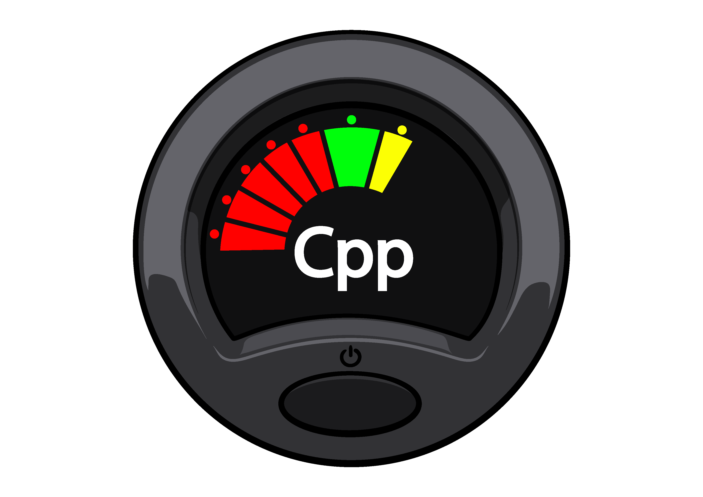

# C++ Guitar Tuner Library
Latest: _v0.0.0_



## Table of Contents
* [Summary](#Summary)
* [Installation](#Installation)
* [Normal Usage](#Normal-Usage)
* [Web Assembly](#Web-Assembly)
* [More Examples](#More-Examples)
* [License](#License)

## Summary

This is a C++ library that provides functionality for tuning audio stream buffers. It includes functions for performing tuning, retrieving pitch information, and managing the buffer.

## Installation

***WIP***

## Normal Usage

### Examples

```cpp
#include <iostream>

#include <tuner/global.hpp>
#include <tuner/tuner.hpp>

int main() {
    std::array<float, TUNER_SIZE> audio_buffer = {0.1, 0.2, 0.3, 0.4, 0.5};
    int sample_rate = 44100;
    
    tuner::note_context* nc = tuner::tune(audio_buffer, sample_rate);

    std::cout << "Frequency: " << nc->actual_frequency << std::endl;
    std::cout << "Closest Note Frequency: " << nc->closest_note_frequency << std::endl;

    return 0;
}
```

## Web Assembly

### Examples

#### Using the Web Assembly Header File in Cpp
```cpp
#include <iostream>

#include <tuner/global.hpp>
#include <tuner/wa_tuner.hpp>

int main() {
    std::array<float, TUNER_SIZE> audio_buffer = {0.1, 0.2, 0.3, 0.4, 0.5};
    int sample_rate = 44100;
    
    for (int i = 0; i < 5; i++) {
        push_value(audio_buffer[i]);
    }
    
    float frequecny = get_frequeny(sample_rate);

    std::cout << "Frequency: " << frequency << std::endl;

    // Reset buffer offset
    clear_buffer_offset();

    return 0;
}
```

#### Referencing the WASM File

***index.html***
```html
<script type="text/javascript" src="../wasm_tuner.js"></script>
<script type="text/javascript" src="./index.js"></script>
```

***index.js***
```js
function eventLoop() {
    if (navigator.mediaDevices) {
        navigator.mediaDevices.getUserMedia({"audio": true, "video": false}).then((stream) => {
            const audioContext = new AudioContext();
            const mediaStreamAudioSourceNode = audioContext.createMediaStreamSource(stream);
            const analyserNode = audioContext.createAnalyser();
            mediaStreamAudioSourceNode.connect(analyserNode);

            const pcmData = new Float32Array(analyserNode.fftSize);
            const onFrame = async () => {
                analyserNode.getFloatTimeDomainData(pcmData);
                
                for (let i = 0; i < pcmData.length; i++) {
                    
                    // Push audio samples from pcmData into WASM memory
                    Module.ccall('push_value', null, ['float'], [pcmData[i]]);
                    index += 1;

                    if (index === 2048) {
                        // Get the pitch for the audio samples in WASM memory
                        let pitch = Module.ccall('get_pitch', 'float', ['int'], [stream.getAudioTracks()[0].getSettings().sampleRate]);

                        // Clear the buffer and go again
                        Module.ccall('clear_buffer_offset', null, [], []);
                        index = 0;
                    }
                }
                setTimeout(() => {
                    window.requestAnimationFrame(onFrame);
                }, 200);

            };
            window.requestAnimationFrame(onFrame);
        }).catch((err) => {
            // browser unable to access microphone
            // (check to see if microphone is attached)
            // <HANDLE ERROR HERE>
        });
    } else {
        // browser unable to access media devices
        // (update your browser)
        // <HANDLE ERROR HERE>
    }
}

Module.onRuntimeInitialized = function() {
    eventLoop();
}
```


## More Examples

More examples can be found in [./tuner/tuner.acceptance_test.cpp](https://github.com/nvisal1/)

## License

This library is provided under the [MIT License](https://opensource.org/licenses/MIT). Feel free to modify and use it in your projects.
